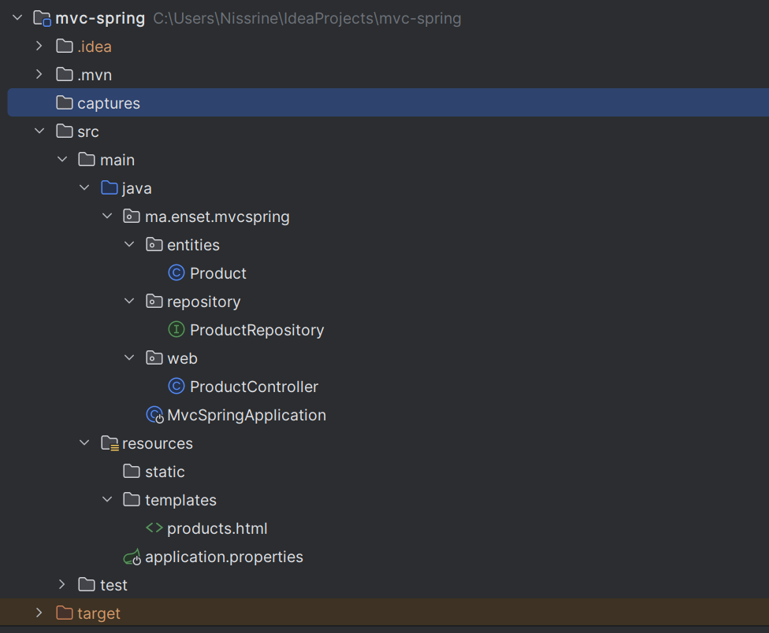
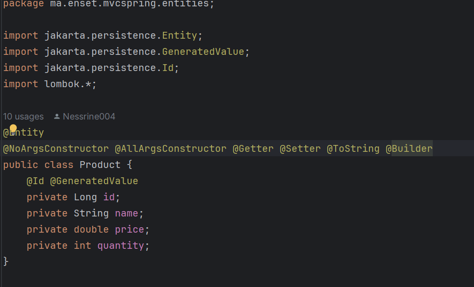
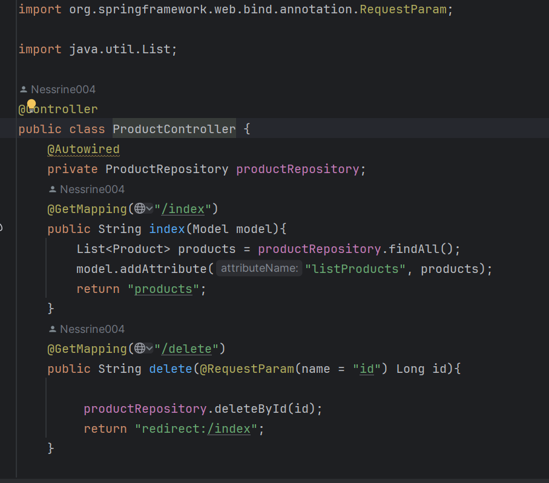
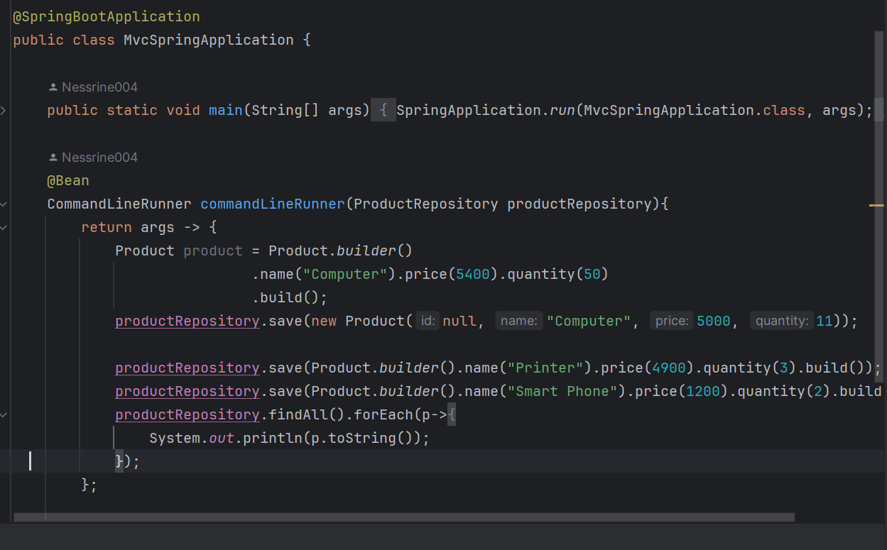
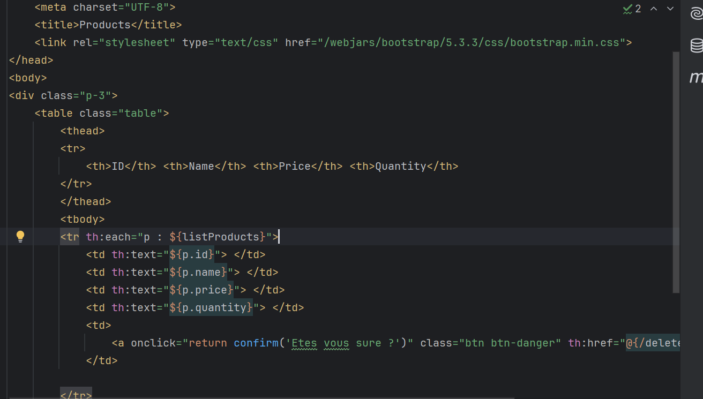
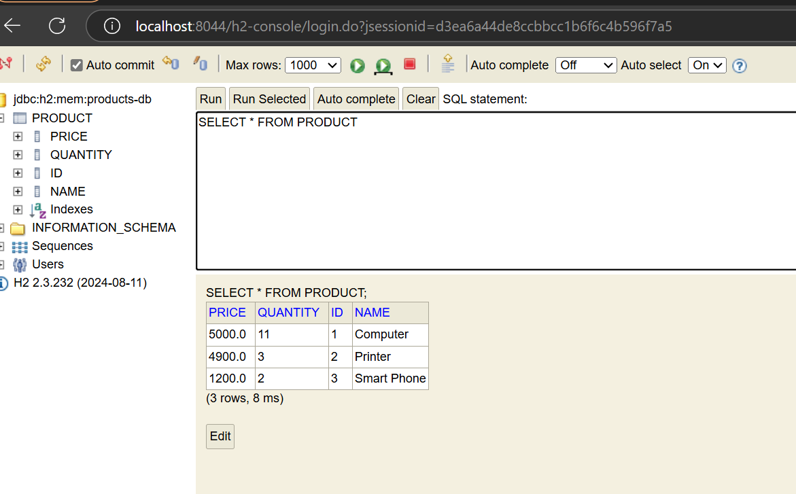
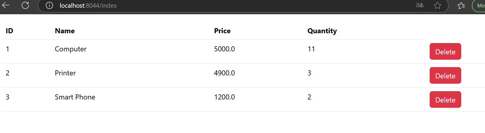

<h2>Partie 0</h2>
<h4>Architecture du projet</h4>

<h4>La classe Product</h4>

<h4> le controller</h4>

<h4>l'application spring</h4>

<h4>le fichier html</h4>

<h4>Base de donnees avec h2</h4>

